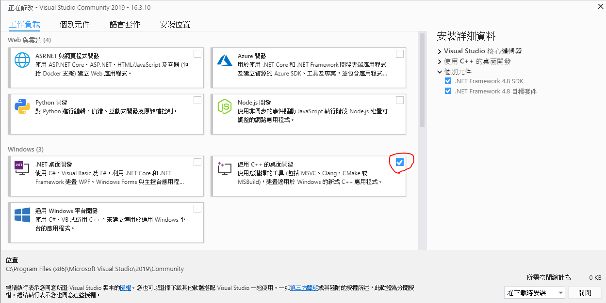

# How to Intall metis 5.1.0 in Win10

最近研究一篇論文  
2019 Cluster-GCN: An Efficient Algorithm for Training Deep and Large Graph Convolutional Networks  
論文實現需要使用graph clustering 的工具 [Metis](http://glaros.dtc.umn.edu/gkhome/metis/metis/download)
除此之外 還需要python的[warper](https://metis.readthedocs.io/en/latest/#installation) (這個安裝用 pip install即可，不多說明)  
在安裝的過程中花了很多時間採坑，中間看到有個pymetis的套件看起來安裝好像比較簡單，但是遇到一堆問題  
最後還是按照paper的做法安裝metis 與python warpper，因此記錄安裝的流程並分享給大家  
最後安裝成功流程主要參考Stackflow的一篇文章[How to install METIS package in python on windows?](https://stackoverflow.com/questions/50675790/how-to-install-metis-package-in-python-on-windows)  


## Envirement

OS: Win10 x64  
Python 3.7

## Requirement

1. [Cmake 2.8](https://cmake.org/) (in metis document)
2. [Visual Studio](https://visualstudio.microsoft.com/zh-hant/downloads/?rr=https%3A%2F%2Fwww.google.com%2F)
 
這裡我選擇安裝  Cmake 3.16  與 Visual Studio 2019(x64)  
順便一提，會選擇這樣的版本是因為使用 Cmake 建立 metis 的時候，Cmake 2.8 只支援到 Visual Studio 2013  
相信只要抓相容的Visual Studio，Cmake 2.8 也是可以的  
Visual Studio 安裝的時候記得勾選 "使用C++的桌面開發"(desktop application development using c++)





## Download metis and unzip

你可以在這裡下載<font color=red>官方</font>[Metis](http://glaros.dtc.umn.edu/gkhome/metis/metis/download)
但是根據參考文章的步驟，我最後安裝成功的是[conda-metis](https://github.com/menpo/conda-metis)
下載完畢後解壓縮

## Metis document

將Metis 打開以後，你可以在裡面看到三個安裝文檔: "install.txt" , "Build.txt" , "Build-Windows.txt"  
但是只按照上面的步驟，<font color=red>我怎麼樣都安裝不成功...</font>，所以還是參考ref.中的步驟吧

### Install.txt


These are some preliminary instructions for the 5.0 release of METIS.

1. You need to have a C compiler that supports the C99 standard. 
   Gcc works just fine, but I have not tested it on many other architectures
   (any feedback/patches for different architectures are welcomed)
   
2. You need to have GNU make and CMake 2.8 (http://www.cmake.org/) installed.

3. Edit the file include/metis.h and specify the width (32 or 64 bits) of the
   elementary data type used in METIS. This is controled by the IDXTYPEWIDTH
   constant.

   For now, on a 32 bit architecture you can only specify a width of 32, 
   whereas for a 64 bit architecture you can specify a width of either 
   32 or 64 bits.


4. At the top of Metis' directory execute 'make' and follow the instructions.
   
      make

5. To build on windows using Visual Studio follow the instructions in the
   file BUILD-Windows.txt.


### Build-Windows.txt

Building METIS requires CMake 2.8, found at
http://www.cmake.org/. CMake generates Visual Studio project files,
which then can be built using Visual Studio. There are two ways to
generate visual studio files: using the command line and using the
CMake GUI.

<font size=4>Using the command line</font>

Open the command prompt and cd to the METIS source directory. Run

    > cmake --help

and look at the list of generators for the Visual Studio studio you
want to build for. For example, the generator for Visual Studio 2010
is called "Visual Studio 10".

After you have found the appropriate generator, run

    > .\vsgen -G "<GENERATOR>"

to generate the project files. The project files will be placed
build\windows.


<font size=4>Using the CMake GUI</font>

It is also possible to use the CMake GUI, distributed with CMake. To
do this, open the CMake GUI, and browse to the location of METIS'
source with the "Browse Source" button. You can also change the binary
directory. This is where the Visual Studio project files will be
placed. Click "Generate" to select the correct visual studio version
and build the project files.

<font size=4>Using the VS project files</font>

The Visual Studio project will be called METIS.sln. Open it in Visual
Studio. If the configuration is not already "Release", set it to
"Release". Type F7 to build. The METIS library will be in
<BINARY_DIR>\libmetis\Release and the executable programs will be in
<BINARY_DIR>\programs\Release. (<BINARY_DIR> will be build\windows if
you used the command line or whatever you choose if using the CMake
GUI.)


##  安裝步驟Install Step: 

1. 設定環境變數:(使用管理員權限執行以下command)  

   VS 2017  
   set VCTargetPaths=C:\Program Files (x86)\Microsoft Visual Studio\2017\Community\Common7\IDE\VC\VCTargets  
   
   VS 2019  
   set VCTargetPaths=C:\Program Files (x86)\Microsoft Visual Studio\2019\Community\MSBuild\Microsoft\VC\v160    
   
   順帶一提，我當初忘記使用最高權限開啟command line。= =....  
   所以這個步驟或許不影響

2.  修改註冊表:

    打開你的註冊表(regedit)  
    找到Computer\HKEY_LOCAL_MACHINE\SOFTWARE\Microsoft\MSBuild\  
    我們要修改兩個變數(variable)
    1) .\4.0\ 中的變數MSBuildOverrideTasksPath
    2) .\ToolVersion\4.0\ 中的變數 MSBuildToolPath
    將兩個變數修改為: C:\Program Files (x86)\Microsoft Visual Studio\2019\Community\MSBuild\15.0\Bin  
    如果是VS 2017,就將路徑中的2019改為2017 

3. 修改CMakeList.txt:

   對於 python metis ，我們需要.dll 檔而非 .lib檔案  
   編輯C:\\<your path\>\conda-metis\CMakeLists.txt  
   在第19行(line 19)加入 set(METIS_LIBRARY_TYPE SHARED)

  4.  修改 metis.h (option):
  
      編輯 C:\\<your path\>\conda-metis\include\metis.h  
      將變數 IDXTYPEWIDTH 從 32改為64  
      <font color=red>注意只有x64的系統才可以修改，x86不行</font>

5.  確認Cmake相容性:  

    開啟 command line，並到conda-metis路徑中  
    run: cmake--help  

    這時候會跑出一堆generator 的list，如 "Visual Studio 16 2019"  
    如果沒有，就代表你的Cmake 版本跟 VS 不匹配，要再去找相容的版本

6. 在conda-metis的路徑中  
   run: .\vsgen -G "Visual Studio 16 2019" -A x64  
   如果是安裝 x86的VS，指令改為 .\vsgen -G "Visual Studio 16 2019"   
   如果執行正常的話，資料夾 conda-metis\build\windows\ 裡面應該就有許多檔案(如METIS.sln 等)

7.  修改gk_arch.h : (在VS build metis時的rint()問題，詳情請見[連結](https://stackoverflow.com/questions/35562135/rint-issue-after-creating-vs-project-using-cmake))  
    編輯 C:\\<your path\>\conda-metis\GKlib\gk_arch.h  
    找到  #define rint(x) ((idx_t)((x)+0.5)) 並<font color=red>刪除</font>

8.  建立資料庫檔案:  
    用Viusal Studio 打開 C:\\<your path\>\conda-metis\build\windows\METIS.sln  
    打開時我的方案組態(configuration) 已經是Release  
    在上方指令選擇 "建置(B)" (Build) => "為解決方案建置完整程式資料庫" (Build Solusion)

9. 設定METIS_DLL環境變數:  
   如果Step8正常執行，metis.dll檔案會在  
   C:\\<your path\>\conda-metis\build\windows\libmetis\Release\
   run: set METIS_DLL=C:\\<your path\>\conda-metis\build\windows\libmetis\Release\metis.dll

10.  安裝 metis python warpper:metis(0.2a4):  
     in command line  
     run: pip install metis
     
以上是參考文章都有提及的東西，但是你還可能會遇到兩個問題:  
1)如果你有執行Step 4.的話，在使用python metis 的時候會遇到error:Out of Memory的問題  
2)如果你是用python package: networkx 2.4 的Graph當作input，你會遇到error: 'Graph' object has no attribute 'node'

11. 編輯metis.py:  
    我在Anaconda上使用深度學習，metis.py 會在  
    C:\Users\\<User name\>\Anaconda3\envs\\<envs name\>\Lib\site-packages\metis.py  
    
    問題1)  
    option 1 :設定環境變數 run: set METIS_IDXTYPEWIDTH = 64   
    option 2.:edit line 131 at metis.py:  
    IDXTYPEWIDTH  = os.getenv('METIS_IDXTYPEWIDTH', '64')
    
    問題2)
    在metis.py 中搜尋 ".node"  
    將所有 H.node 修改為 H.nodes，總共有三個需要修改

## 測試


```python
import metis
from networkx import karate_club_graph

zkc = karate_club_graph()
graph_clustering=metis.part_graph(zkc)
```

如果沒遇到問題，恭喜你完成安裝啦!!!
